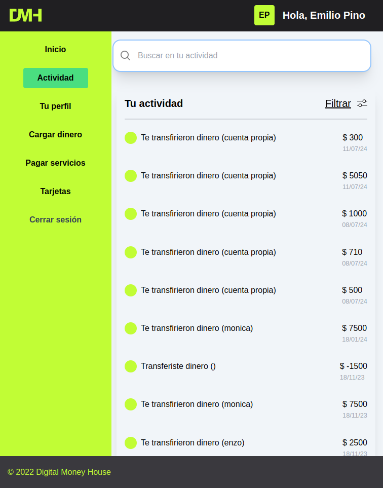
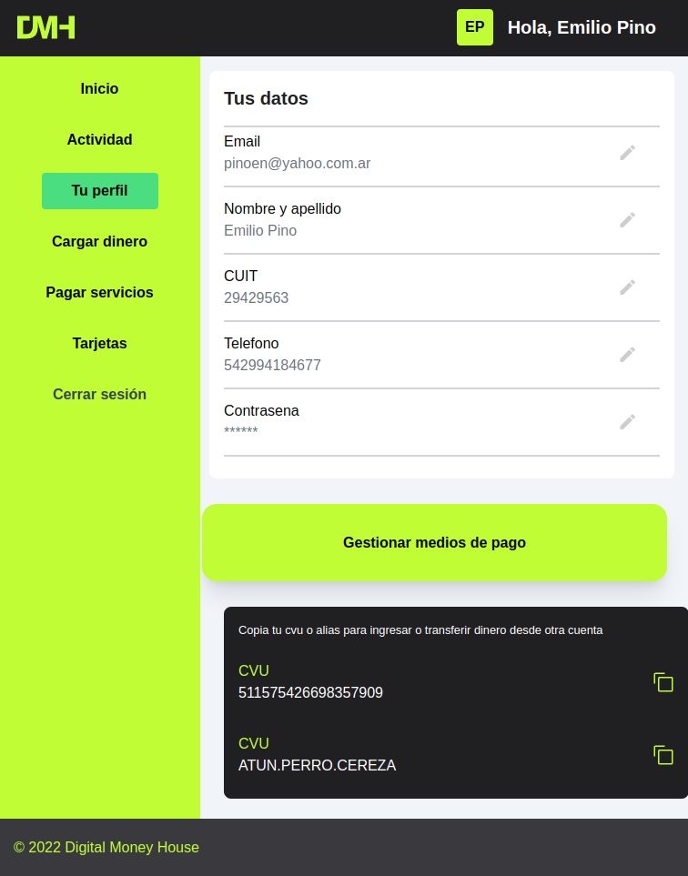
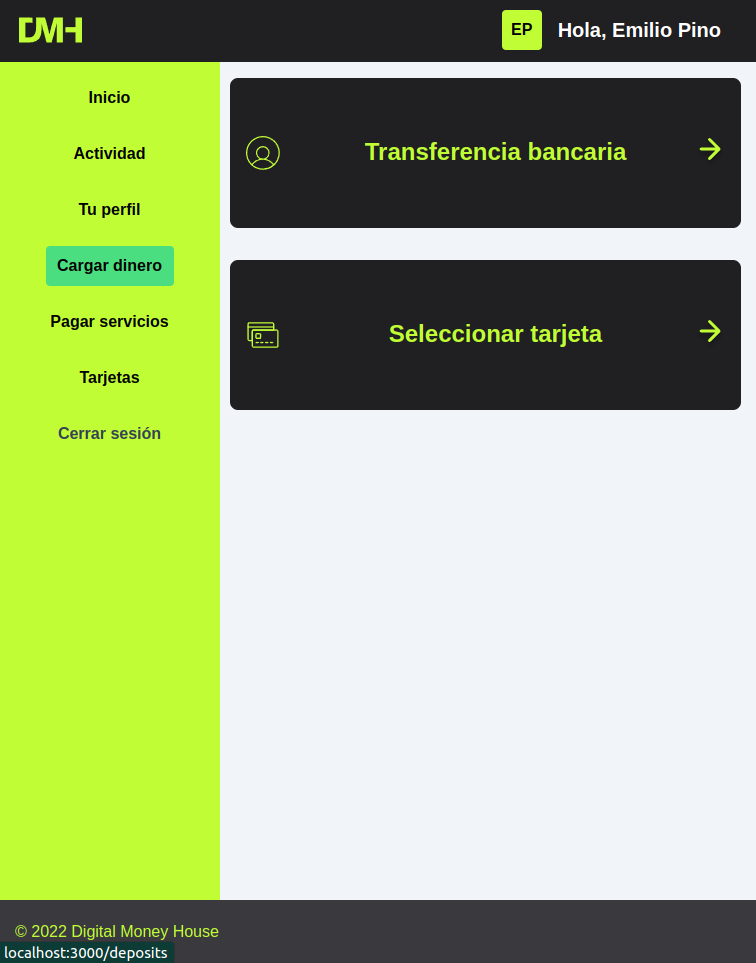

<br />

<div align="center">
<br />
<div align="center">

<h3 align="center">Digital Money House</h3>

  <p align=center">
    Este producto digital es el mínimo producto viable de una billetera virtual, donde el usuario tiene las
funcionalidades básicas de registro, inicio y cierre de sesión, dar de alta medios de pago como tarjetas de crédito o débito, recargar saldo en su billetera y poder usar los medios de pago o el saldo de su billetera para pagar servicios.
    <br />
    <br />

</div>

<h1 align="center"> 
Funcionalidades
</h1>

### - Página de inicio o landing page

### - Página de registro de usuario

### - Página de login

### - Página de dashboard

### - Página de perfil de usuario

### - Página de gestión de pago

### - Página de ingreso de dinero

### - Página de actividad del usuario

### - Página de pago de servicios

<br />

<h1 align="center"> 
Tecnologias Utilizadas
</h1>


<h1 align="center"> 
Instrucciones para ejecutar la app
</h1>

Instrucciones para clonar el repo y ejecutar el proyecto localmente:

1- Clonar este repositorio

```sh
git clone git@github.com:pinoen/digital-money-house.git
```

2- Abrir la terminal y correr el comando:

```sh
cd digital-money-house
```

3- Finalmente ejecutar los comandos:

```sh
npm install
npm run dev
```

O simplemente clickea en el link de
<a href="https://digital-money-house-pinoen.vercel.app/landing" target="_blank">Visitar App</a>

<br>
<hr/>
<br>

<h1 align="center"> 
Capturas de Pantalla de las diferentes Páginas
</h1>









<h1 align="center"> 
Agradecimientos
</h1>

[Digital House](https://www.digitalhouse.com/ar)
